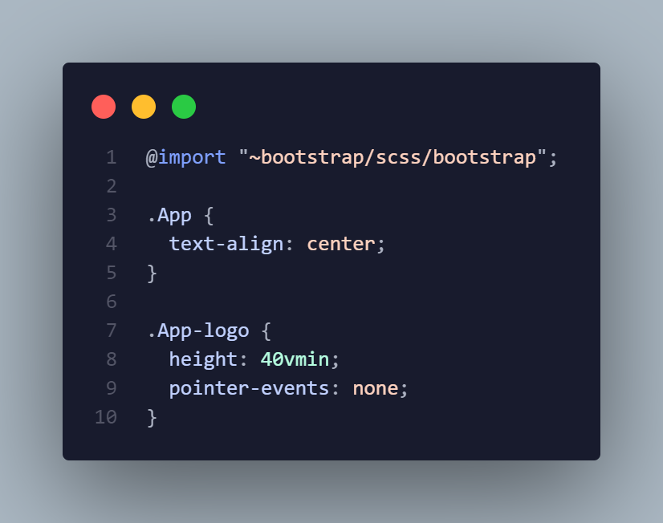
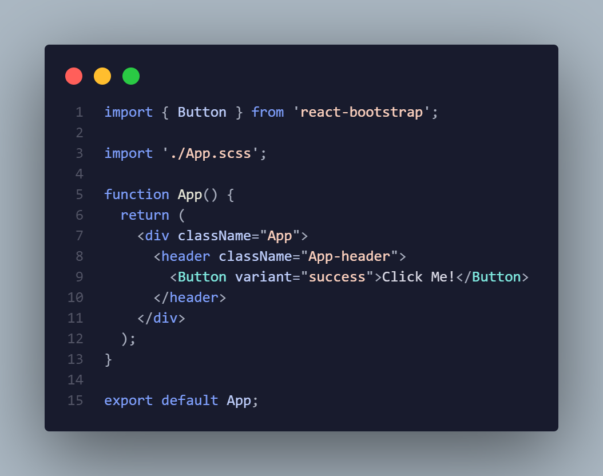
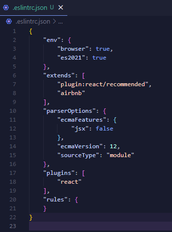
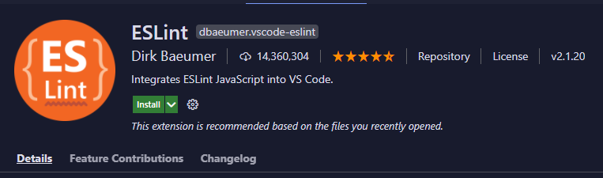

# Estructura Proyecto React.js

## Instalación de paquetes necesarios

1.- Instalación y configuración de Sass

- `npm install node-sass --save`
- cambiar las extensiones `.css` por `.scss`
- mas detalles en la documentación de [React.js](https://create-react-app.dev/docs/adding-a-sass-stylesheet/).

2.- Instalación de React Bootstrap

- `npm install react-bootstrap bootstrap@4.6.0`
- Importar los estilos de bootstrap: Para importar los estilos de bootstrap debemos movernos al archivo `App.scss` y dentro de este colocar la instrucción `@import "~bootstrap/scss/bootstrap";` en la primera línea. 
    
- Agregar un componente de ejemplo: - Una vez importadas las variables podemos verificar que todo funcione correctamente. En el ejemplo se agrega un botón y debería mostrar en la vista. 
  

3.- Instalación React Router
- `npm install react-router-dom`
- Debemos crear dos componentes que serán utilizados como paginas en nuestra aplicación, en este caso tengo el componente `Login` y `Home`
- Una vez hecho esto, debemos modificar el archivo `App.js` que es donde se va agrega el enrutamiento: - Agregamos el código del ejemplo y nos dirigimos al navegador para probar las rutas, después del dominio simplemente se escribe la ruta por ejemplo `dominio/votos` y verificamos que el enrutamiento funcione correctamente. 
   - mas detalles en la documentación de [React Router](https://reactrouter.com/web/guides/quick-start)

4.- Instalación Hook de formulario (React Form Hook)

- `npm install react-hook-form`
- Lo siguiente es instalar un paquete de `npm` que permita manejar el uso y validación de los formularios, para eso se usa el comando anterior.

5.- Instalación de Axios
- Instalamos axios con el siguiente comando `npm install axios`.
- Se puede revisar la documentación de [axios](https://github.com/axios/axios) para mas detalles.
- Configuración de `instance` y `interceptors` en un archivo `utils/axios.js`.

## Linters y Formatos &nbsp;&nbsp;

1.- Instalación y Configuración de ESLint

- Instalamos la dependencia de manera local (en el proyecto) y solo para entorno de desarrollo, ejecutamos el siguiente comando: `npm install eslint --save-dev`.
- Creamos un archivo de configuración para ESLint con el siguiente comando: `npx eslint --init`.
- Lo siguinte es hacer la instalación de la extensión en nuestro editor (esto para VSCode y es opcional pero es muy útil). Buscamos la extensión ESLint:
- Se genera un archivo `.eslintrc.json` donde se encuentra la configuración de ESLint. 
  
- Instalamos la extensión de ESLint para Visual Studio Code.
- Podemos revisar la [Configuración de Reglas](https://eslint.org/docs/user-guide/configuring/rules#configuring-rules) de ESLint. 
  

- Instalamos la extensión de Prettier y abrimos la configuración del editor `Ctrl + Shift + p` y escribimos `Settings` y buscamos la opción que tenga `JSON`. Dentro del archivo solo necesitamos escribir las siguientes propiedades: 
  <pre>
  {
    "editor.formatOnSave": true,
    "editor.defaultFormatter": "esbenp.prettier-vscode",
    "prettier.requireConfig": true,
  }
  </pre>
  Con estas propiedades definimos a Prettier como nuestro formateador de código por defecto (en caso de tener otro instalado) y hacemos que el código se formatee cuando guardemos un archivo. La última propiedad indica que se hará el formateo correspondiente cuando exista un archivo de configuración de `.prettierrc`.
- Deshabilitar configuración default de Prettier que hace conflicto con ESLint, instalamos el siguiente paquete: `npm install -D eslint-config-prettier`. Agregamos a el arreglo de herencias el valor de prettier => `["airbnb", "prettier"]`
- `npm install -D eslint-plugin-prettier prettier` -> Instalamos el plugin de prettier para ESLint.

## Configuración Variables de Entorno 🧰 🔩
1.- Comenzamos creando dos archivos en la raíz `.env.development` y `.env.production`

2.- Dentro de las variables colocamos constantes con nuestra base url en este caso sería `REACT_APP_API="/api/"` esta ruta se usa si es un proyecto de ASP.NET Core y está dentro de la carpeta `ClientApp` de otro modo sería necesario colocar la ruta base completa desde el protocolo `http o https`.
