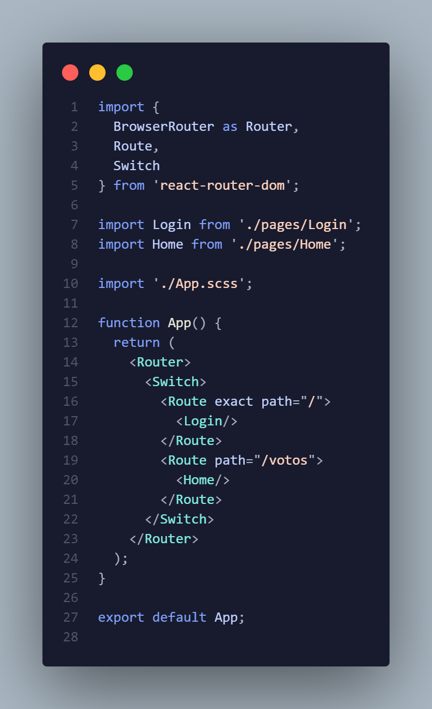

# Estructura Proyecto React.js

## Instalación de paquetes necesarios

1.- Instalación y configuración de Sass
* `npm install node-sass --save`
* cambiar las extensiones `.css` por `.scss`
* mas detalles en la documentación de [React.js](https://create-react-app.dev/docs/adding-a-sass-stylesheet/).

2.- Instalación de React Bootstrap
* `npm install react-bootstrap bootstrap@4.6.0`
* Importar los estilos de bootstrap:
    - Para importar los estilos de bootstrap debemos movernos al archivo `App.scss` y dentro de este colocar la instrucción `@import "~bootstrap/scss/bootstrap";` en la primera línea.
    - 
* Agregar un componente de ejemplo:
    - Una vez importadas las variables podemos verificar que todo funcione correctamente. En el ejemplo se agrega un botón y debería mostrar en la vista.
    - 
3.- Instalación React Router
* `npm install react-router-dom`
* Debemos crear dos componentes que serán utilizados como paginas en nuestra aplicación, en este caso tengo el componente `Login` y `Home`
* Una vez hecho esto, debemos modificar el archivo `App.js` que es donde se va agrega el enrutamiento:
    - Agregamos el código del ejemplo y nos dirigimos al navegador para probar las rutas, después del dominio simplemente se escribe la ruta por ejemplo `dominio/votos` y verificamos que el enrutamiento funcione correctamente.
    - 
    - mas detalles en la documentación de [React Router](https://reactrouter.com/web/guides/quick-start)

4.- Instalación Hook de formulario (React Form Hook)
* `npm install react-hook-form`
* Lo siguiente es instalar un paquete de `npm` que permita manejar el uso y validación de los formularios, para eso se usa el   comando anterior.

## Linters y Formatos  &nbsp;&nbsp;&nbsp;&nbsp;

1.- 